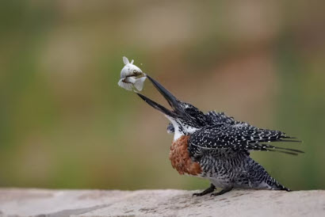
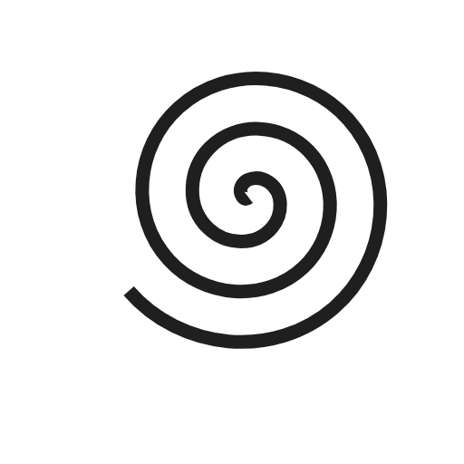
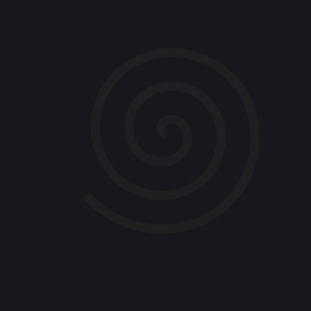
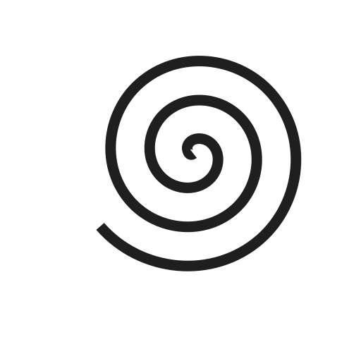

You can add images to your `.md` pages by using the [Markdown](https://daringfireball.net/projects/markdown/syntax#img) syntax for images.

## Examples

### Page resource

```md

```


#### Rendered HTML

```html

```

### Global resource

```md

```


### Remote resource

```md

```


## Handling SVG images in Markdown

[A recent contribution to Thulite Images added using SVG images in Markdown](https://github.com/thuliteio/images/pull/36)

There is a caveat, however. An SVG with a grey stroke instead of black stroke,
and the default background (tranparent) will have little contrast in dark mode
(see below), but it will look fine in light mode (immediately below).

```md

```


```md

```


This can be remedied with by adding

```scss
// Put your custom (S)CSS variables here
:root {
  --markdown-svg: yellowgreen;
}
```

to `assets/scss/common/_variables-custom.scss`, when using the `doks` theme.

This gives:

```md

```


which looks the same with both light and dark themes.
